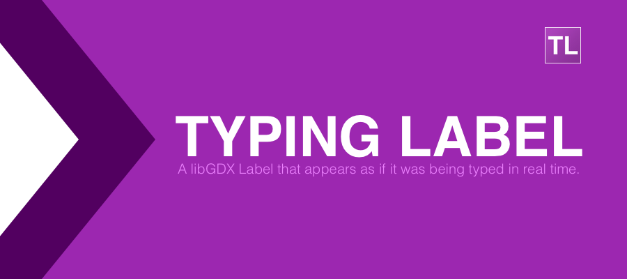

# TypingLabel

[](https://search.maven.org/#search%7Cga%7C1%7Ca%3A%22typing-label%22)
[](https://github.com/rafaskb/typing-label/blob/master/LICENSE)

A libGDX Label that appears as if it was being typed in real time.

It works as a drop-in replacement for normal [Scene2D Labels](https://github.com/libgdx/libgdx/wiki/Scene2d.ui#label), and you can use optional [tokens](https://github.com/rafaskb/typing-label/wiki/Tokens) to customize the text's behavior.


## Installation

Open _build.gradle_ in project root and add this to the _ext_ section under _allprojects_:

```groovy
typingLabelVersion = '1.2.0'
regExodusVersion = '0.1.12' // Only if you're using HTML / GWT
```

#### Core module

Add this to your _build.gradle_ core dependencies:
```groovy
api "com.rafaskoberg.gdx:typing-label:$typingLabelVersion"
```

> _Note: Replace `api` with `compile` if you're using a Gradle version older than 3.4._

#### HTML dependencies
###### (Only if you're using HTML / GWT)

Add this to your _GdxDefinition.gwt.xml_ file:
```xml
<inherits name="com.rafaskoberg.gdx.typinglabel.typinglabel" />
```

Add this to your _build.gradle_ html dependencies:
```groovy
api "com.github.tommyettinger:regexodus:$regExodusVersion:sources"
api "com.rafaskoberg.gdx:typing-label:$typingLabelVersion:sources"
```

> _Note: Replace `api` with `compile` if you're using a Gradle version older than 3.4._


## Getting Started

Check the Wiki:
- [Usage examples](https://github.com/rafaskb/typing-label/wiki/Examples)
- [Tokens](https://github.com/rafaskb/typing-label/wiki/Tokens)
- [Fine tuning](https://github.com/rafaskb/typing-label/wiki/Fine-Tuning)
- [Custom Effects](https://github.com/rafaskb/typing-label/wiki/Tokens#custom-effects)
